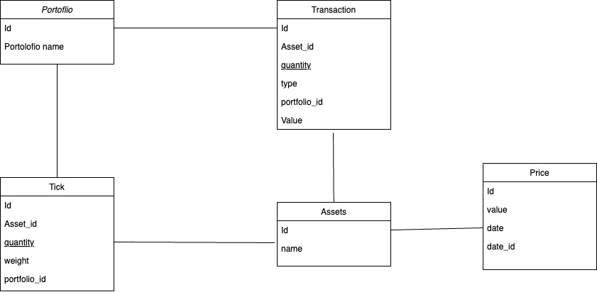

# AbaqusPortfolio

My Abaqus Tracker es una aplicación Django para gestionar portafolios de inversiones, incluyendo la compra y venta de activos.

## Características

- Se puede subir un archivo .xslx, que permite agrergar/actualizar un portafolio. Este debe contener los precios de los activos y los weights de n portafolios, para una fecha.
- La API nos entregara los valores de los portafolios y los weights de los activos entre dos fechas para un portafolio en especifico.
- Registro de transacciones de compra y venta, de activos.
- Se permite el reinicio de todas transacciones.
- Comparacion del valor del portafolio y sus weights entre a traves del tiempo
- Los formularios que tienen fechas, tienen la validacion de la primera fecha de precio y final, ademas de las transacciones no pueden ser echas por un monto mayor al que tiene el portafolio.

### Consideraciones especiales tomadas

- En la vista de comparacion, se da la opcion de comparar solamente los valores de un mismo portafolio. No entre dos portafolios distintos.

## Diagrama de la base de datos



## Manual de instalacion

### Requisitos

Para esto, todo es gestonable mediante el uso de conda y poetry.

- Python 3.10
- Conda
- Poetry

### Instalación

1. Clona el repositorio:

   ```bash
   git clone https://github.com/tuusuario/my-abaqus-tracker.git
   cd my-abaqus-tracker
   ```

2. Crea y activa un entorno con Conda:

   ```bash
   conda create -n abaqus python=3.10
   conda activate abaqus
   ```

3. Instala Poetry si no lo tienes instalado:

   ```bash
   conda install poetry
   ```

4. Instala las dependencias con Poetry:

   ```bash
   poetry install
   ```

5. Realiza las migraciones de la base de datos:

   ```bash
   python manage.py makemigration

   ```

6. Realiza las migraciones de la base de datos:

   ```bash
   python manage.py migrate

   ```

7. Inicia el servidor de desarrollo:

   ```bash
   python manage.py runserver
   ```

8. Accede a la aplicación en tu navegador:

   ```bash
   http://127.0.0.1:8000/
   ```
